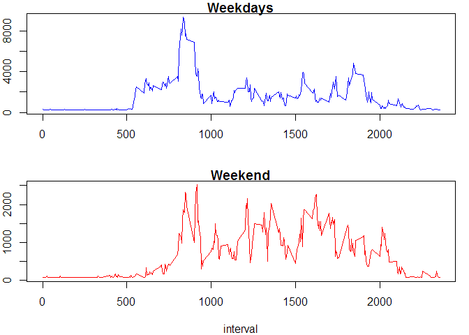

# Reproducible Research: Peer Assessment 1


## Loading and preprocessing the data

```r
unzip("activity.zip", exdir = ".")
activity <- read.csv("activity.csv", header = TRUE,  na.strings = "NA", )
activity$date <- as.POSIXct(activity$date)
```


## What is mean total number of steps taken per day?

```r
dailyData <- aggregate(activity$steps, by=list(activity$date), FUN=sum, na.rm = TRUE)
names(dailyData) <- c("date", "steps")

hist(dailyData$steps, xlab = "Steps ", col = "blue", breaks=10, main = "Daily steps" )
```


## What is the average daily activity pattern?

```r
stepsMean <- mean(dailyData$steps, na.rm = TRUE)
stepsMedian <- median(dailyData$steps, na.rm = TRUE)

stepsMean
```

```
## [1] 9354.23
```

```r
stepsMedian
```

```
## [1] 10395
```

```r
intervalData <- aggregate(activity$steps, by=list(activity$interval), FUN=sum, na.rm = TRUE)
names(intervalData) <- c("interval", "steps")
with(intervalData, plot(interval, steps, type="l", col = "blue", main = "Steps by interval"))
```


## Imputing missing values

```r
totalMissingValues = sum(is.na(activity$steps))
totalMissingValues
```

```
## [1] 2304
```

```r
stepsMeanByInterval <-mean(activity$steps, na.rm = TRUE)
stepsMeanByInterval <- floor(stepsMeanByInterval)
stepsMeanByInterval
```

```
## [1] 37
```

```r
activityFull <- activity
missingData <- is.na(activityFull$steps)
activityFull$steps[missingData] <- stepsMeanByInterval


dailyDataFull <- aggregate(activityFull$steps, by=list(activityFull$date), FUN=sum, na.rm = TRUE)
names(dailyDataFull) <- c("date", "steps")

hist(dailyDataFull$steps, xlab = "Steps ", col = "blue", breaks=20, main = "Daily steps" )
```


```r
stepsMeanFull <- mean(dailyDataFull$steps, na.rm = TRUE)
stepsMedianFull <- median(dailyDataFull$steps, na.rm = TRUE)

stepsMeanFull
```

```
## [1] 10751.74
```

```r
stepsMedianFull
```

```
## [1] 10656
```


## Are there differences in activity patterns between weekdays and weekends?

```r
library(plyr)
activityFull <- mutate(activityFull, weektype = ifelse(weekdays(activityFull$date) == "Saturday" | weekdays(activityFull$date) == "Sunday", "weekend", "weekday"))
activityFull$weektype <- as.factor(activityFull$weektype)

activityFullWeekday = subset(activityFull,activityFull$weektype == "weekday")
activityFullWeekend = subset(activityFull,activityFull$weektype == "weekend")

intervalDataFullWeekday <- aggregate(activityFullWeekday$steps, by=list(activityFullWeekday$interval), FUN=sum, na.rm = TRUE)
names(intervalDataFullWeekday) <- c("interval", "steps")

intervalDataFullWeekend <- aggregate(activityFullWeekend$steps, by=list(activityFullWeekend$interval), FUN=sum, na.rm = TRUE)
names(intervalDataFullWeekend) <- c("interval", "steps")

par(mfrow = c(2, 1), mar = c(4, 2, 1, 1), oma = c(0, 0, 0, 0))   
with(intervalDataFullWeekday, plot(interval, steps, type="l", col = "blue", xlab = "", main = "Weekdays"))
with(intervalDataFullWeekend, plot(interval, steps, type="l", col = "red", main = "Weekend"))
```



